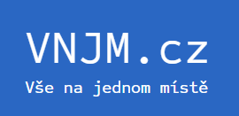
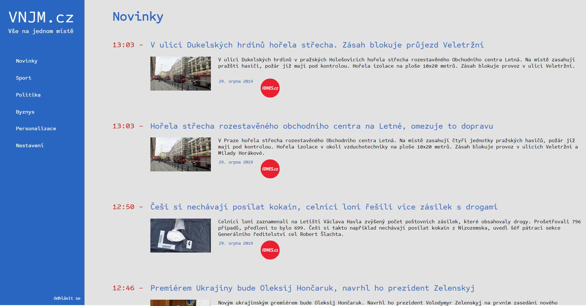
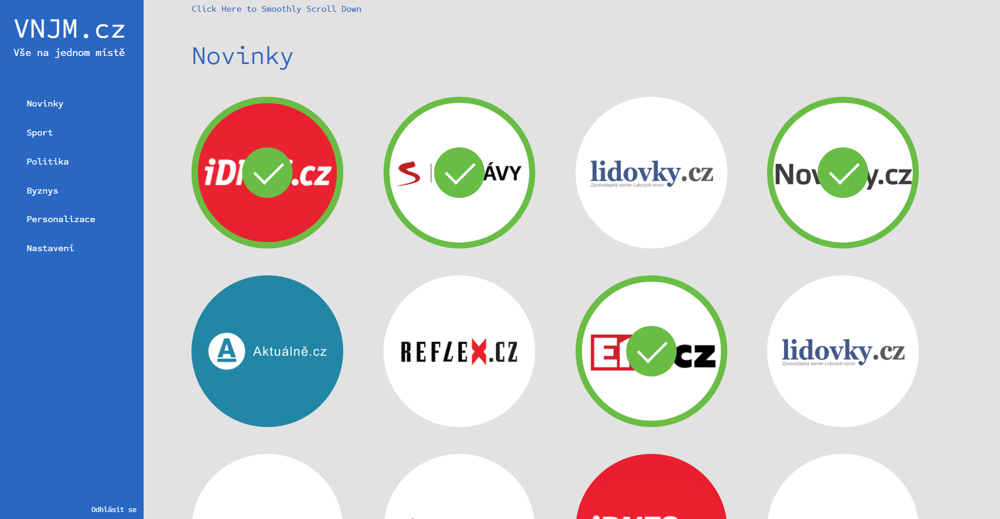

# VNJM.cz
## (Všechnomožné.cz)
Unfinished project similar to Feedly, but with Czech news websites. You can choose preferences in you account and it will then show you articles from those sites ordered by newest. It automatically downloads new artices every *x* minutes. It is programmed using Python microframework Flask, jQuery, HTML and CSS.

### The main page:

### The Personalization of news:

*This website is unfortunately not available online, as there are similar services, so it would not generate any profit. However the site is working as expected*
